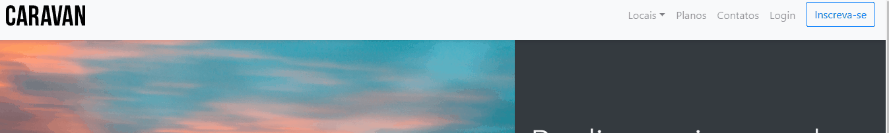
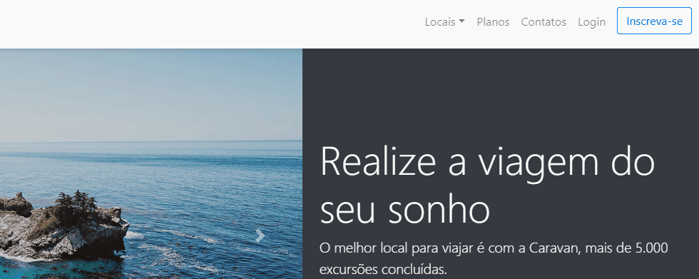

# Caravan

---

> Este projeto foi criado a partir do curso Bootstrap 4 ministrado pelo Designer e Programador André Rafael na plataforma Origamid.

---

## Descrição

Este projeto tem como objetivo construir um site de uma simulação de Agência de Excursões, para tal, utilizar integralmente a biblioteca Bootstrap 4 e suas dependências para constuir todo o layout das páginas que fazem parte deste projeto. Não está implementado qualquer função que necessite de acesso ao Backend, portanto, apenas foram utilizadas tecnologias Front-end para a construção deste projeto.

---

## Caracteristicas

> Exemplo do menu de login flutuante com modal
> 

- Layout Responsivo
- Modal de login
- Carrosel de imagens
- Perguntas frequentes sanfonada
- Navegação com dropdown

---

## Tecnologias

- HTML5
- CSS3
- Javascript
- Bootstrap 4
